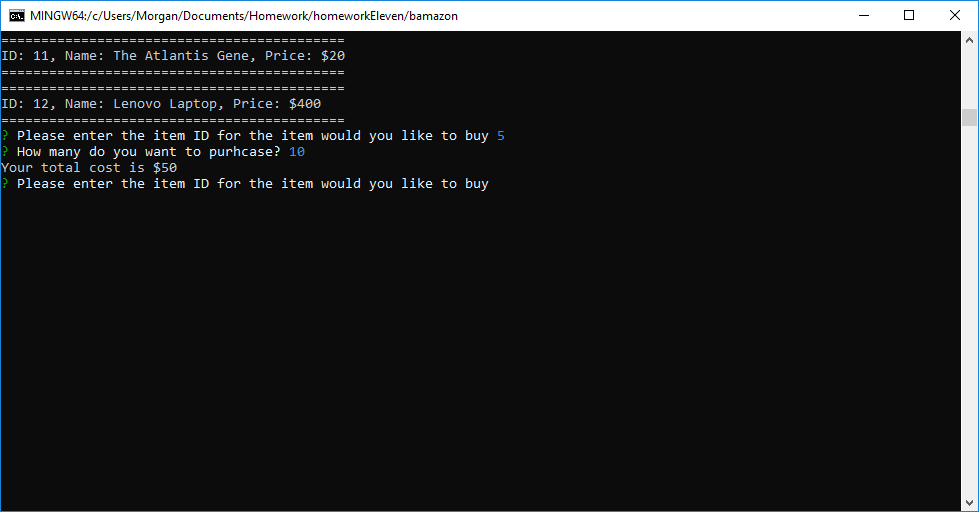
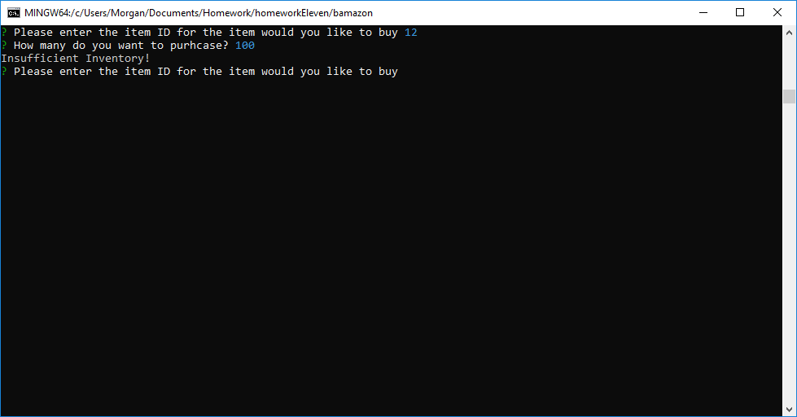
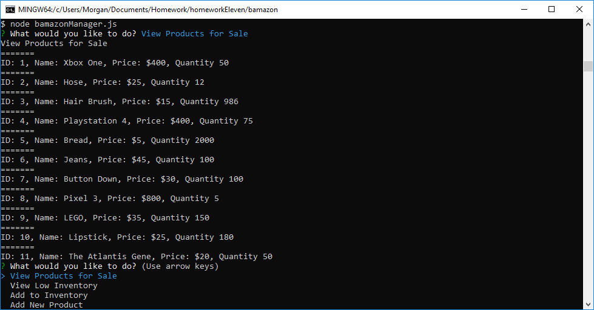
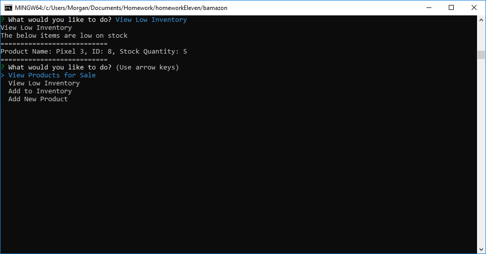
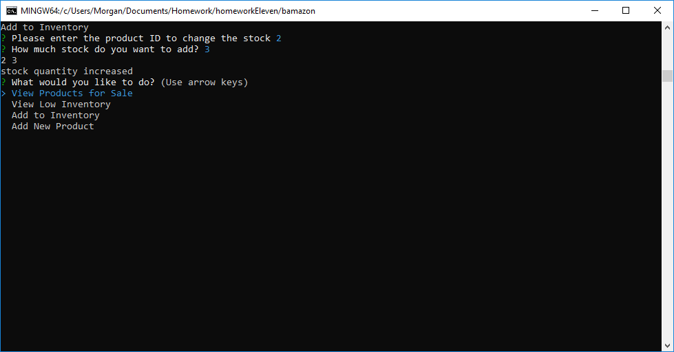
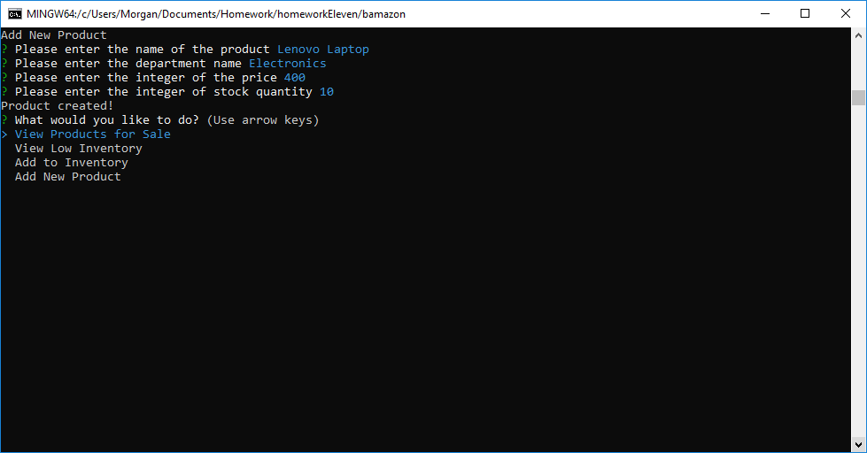

# bamazon

Bamazon Customer walkthrough

This shows you the products that are for sale

After you pick the ID and how much you want, it tells you the cost and reduces the inventory

If you choose to buy more than they have in inventory, you get the below

Bamazon Manager walkthrough

This is the list that the manager can pick through

This is option 1

Option 2

Option 3

Option 4

